# LangGraphにおける循環タスクグラフの実行シーケンス

## 目次

- [概要](#概要)
- [アーキテクチャ概要](#アーキテクチャ概要)
  - [全体アーキテクチャ図](#全体アーキテクチャ図)
  - [コンポーネント関係図](#コンポーネント関係図)
  - [データフロー図](#データフロー図)
  - [主要コンポーネントの役割](#主要コンポーネントの役割)
  - [チャネルとバージョン管理の詳細](#チャネルとバージョン管理の詳細)
- [1. 実行シーケンスの全体像](#1-実行シーケンスの全体像)
  - [Pregelアルゴリズムの3段階実行モデル](#pregelアルゴリズムの3段階実行モデル)
  - [実行シーケンス図（Mermaid）](#実行シーケンス図mermaid)
  - [循環実行の詳細フロー](#循環実行の詳細フロー)
  - [メイン実行ループ](#メイン実行ループ)
- [2. 詳細な実行シーケンス](#2-詳細な実行シーケンス)
  - [初期化フェーズ](#初期化フェーズ)
  - [Super-Step実行フェーズ](#super-step実行フェーズ)
- [3. 循環グラフの制御メカニズム](#3-循環グラフの制御メカニズム)
  - [再帰制限による制御](#再帰制限による制御)
  - [バージョンベースの実行制御](#バージョンベースの実行制御)
- [4. 状態の永続化メカニズム](#4-状態の永続化メカニズム)
  - [チェックポイントシステムの概要](#チェックポイントシステムの概要)
  - [チェックポイントの作成タイミングと詳細プロセス](#チェックポイントの作成タイミングと詳細プロセス)
  - [状態永続化の詳細メカニズム](#状態永続化の詳細メカニズム)
  - [チェックポイント構造](#チェックポイント構造)
  - [チェックポイント保存プロセス](#チェックポイント保存プロセス)
- [5. 循環実行の実例](#5-循環実行の実例)
  - [シンプルな循環グラフ](#シンプルな循環グラフ)
  - [実行シーケンス](#実行シーケンス)
  - [状態追跡例](#状態追跡例)
- [6. エラーハンドリングと制限](#6-エラーハンドリングと制限)
  - [無限ループ防止](#無限ループ防止)
  - [中断制御](#中断制御)
- [7. 実行の再開メカニズム](#7-実行の再開メカニズム)
  - [中断からの再開プロセス](#中断からの再開プロセス)
  - [中断タイプ別の再開処理](#中断タイプ別の再開処理)
  - [状態復元の詳細プロセス](#状態復元の詳細プロセス)
  - [実行再開の実例](#実行再開の実例)
  - [分散環境での実行継続](#分散環境での実行継続)
- [まとめ](#まとめ)

## 概要

LangGraphは、Google Pregelアルゴリズムに基づいた実行エンジンを使用して循環タスクグラフを安全に実行します。循環グラフの実行では、状態の永続化、バージョン管理、中断制御が重要な役割を果たします。

## アーキテクチャ概要

### 全体アーキテクチャ図

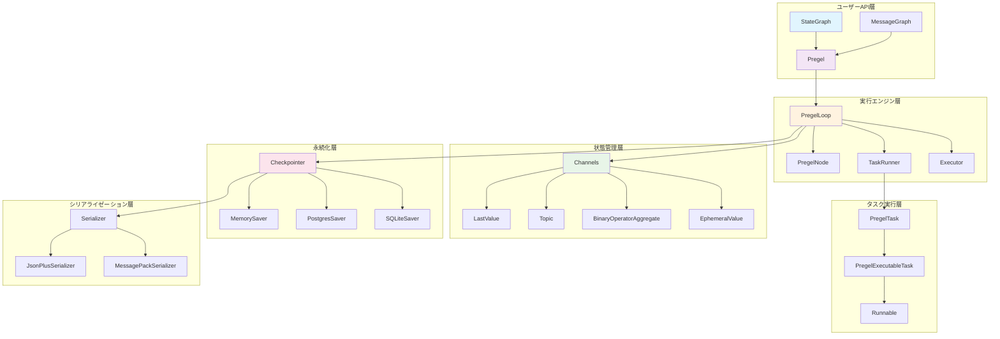

### コンポーネント関係図

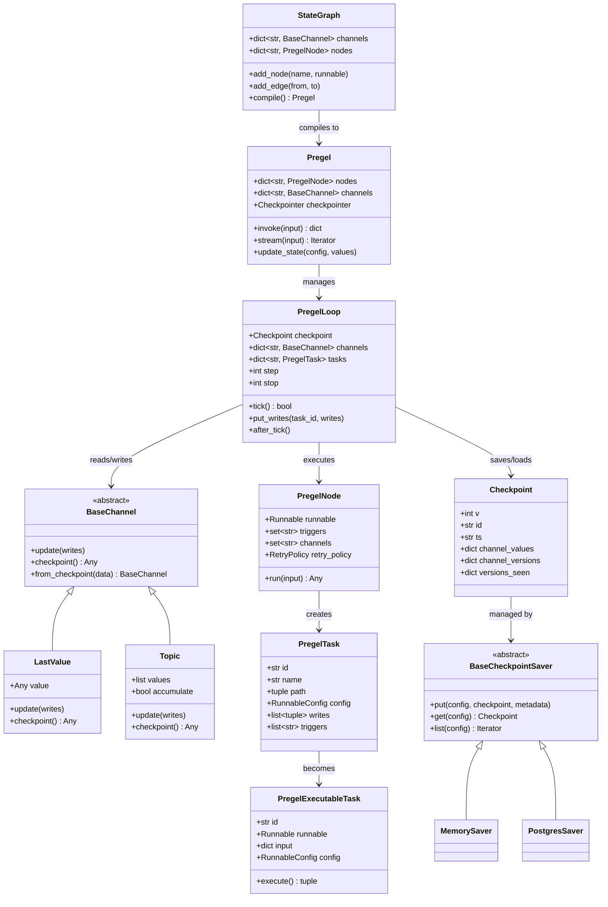

### データフロー図

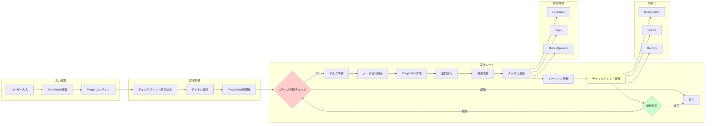

### 主要コンポーネントの役割

#### 1. **StateGraph** - ユーザーAPI層
- **役割**: ユーザーがグラフ構造を定義するための高レベルAPI
- **機能**: ノード追加、エッジ追加、状態スキーマ定義
- **出力**: コンパイル済みPregelインスタンス

```python
# 例：StateGraphの使用
from langgraph.graph import StateGraph

graph = StateGraph({"counter": int, "message": str})
graph.add_node("increment", increment_function)
graph.add_node("message", message_function)
graph.add_edge("increment", "message")
app = graph.compile(checkpointer=checkpointer)
```

#### 2. **Pregel** - 実行エンジン
- **役割**: グラフ実行の中央制御
- **機能**: 実行ループ管理、チェックポイント統合、状態更新
- **関連メソッド**: `invoke()`, `stream()`, `update_state()`

#### 3. **PregelLoop** - 実行制御
- **役割**: 単一実行セッションの管理
- **機能**: ステップカウント、タスクスケジューリング、状態追跡
- **ライフサイクル**: `__enter__()` → `tick()` × N → `__exit__()`

#### 4. **Channels** - 状態管理
各チャネルタイプの特徴：

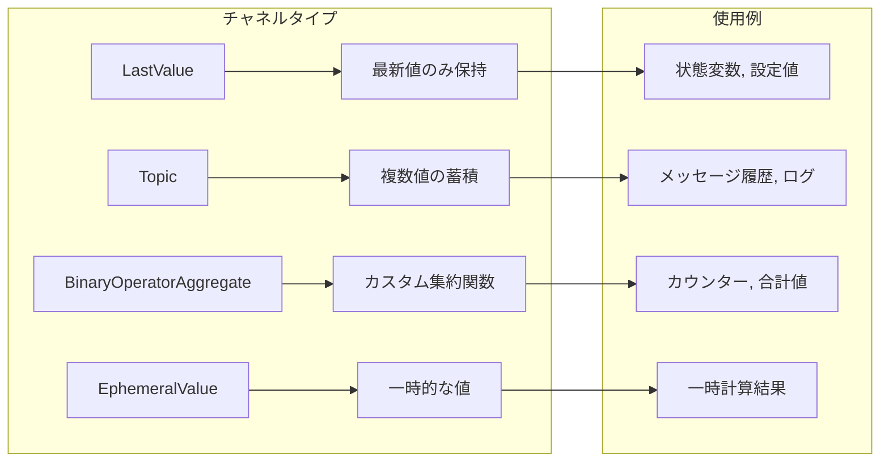

#### 5. **Task実行システム**

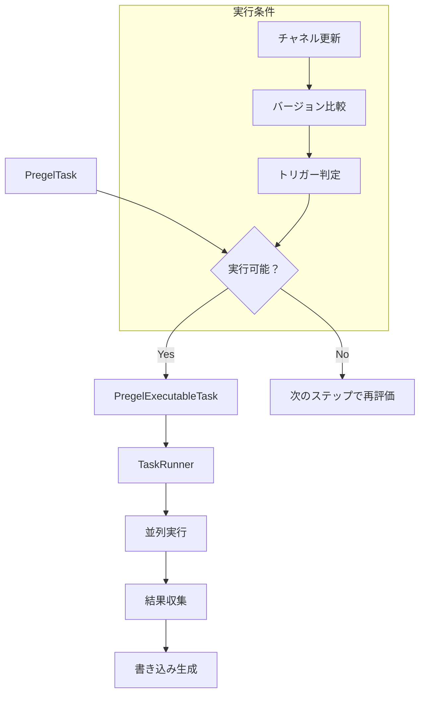

#### 6. **Checkpoint システム**

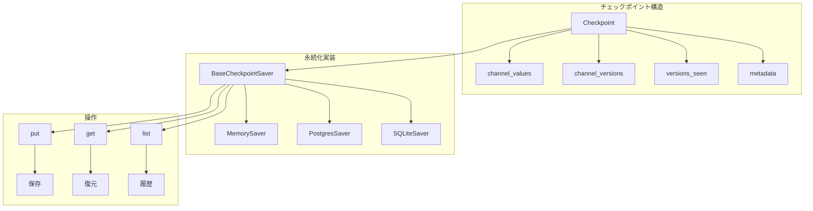

### チャネルとバージョン管理の詳細

#### バージョン追跡システム

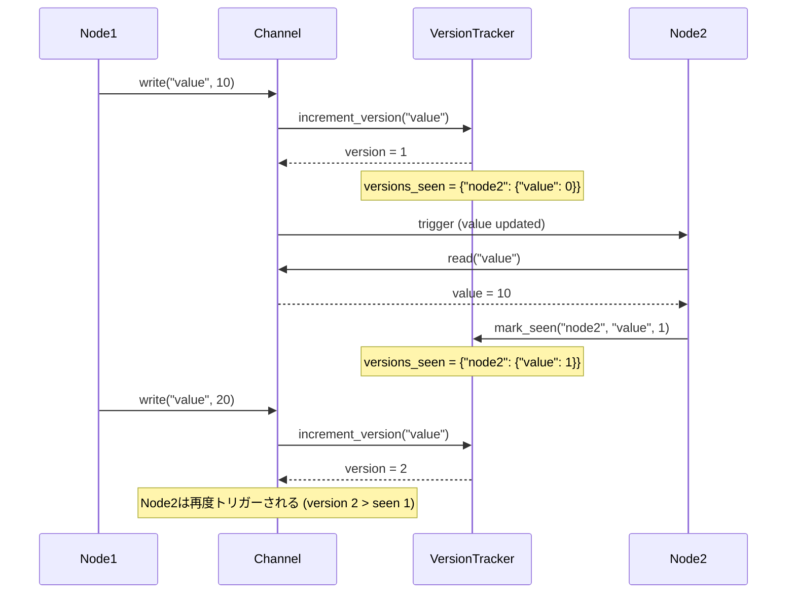

## 1. 実行シーケンスの全体像

### Pregelアルゴリズムの3段階実行モデル

LangGraphの実行は以下の3つの段階を繰り返すステップベースの実行モデルに従います：

```
1. Plan（計画）    -> 実行するノードの決定
2. Execution（実行） -> 選択されたノードの並列実行  
3. Update（更新）   -> チャネルの状態更新とチェックポイント保存
```

### 実行シーケンス図（Mermaid）

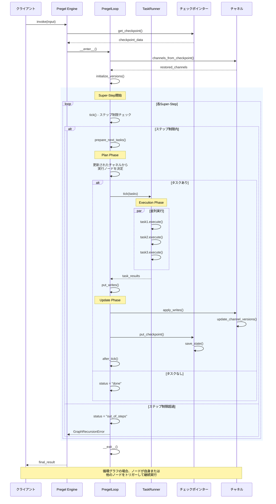

### 循環実行の詳細フロー

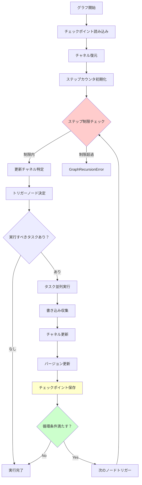

### メイン実行ループ

```python
# pregel/__init__.py:invoke()のメイン実行ループ
while loop.tick():
    # キャッシュされた書き込みの適用
    for task in loop.match_cached_writes():
        loop.output_writes(task.id, task.writes, cached=True)
    
    # 実行可能なタスクの実行
    for _ in runner.tick(
        [t for t in loop.tasks.values() if not t.writes],
        timeout=self.step_timeout,
        get_waiter=get_waiter,
        schedule_task=loop.accept_push,
    ):
        # 出力の生成
        yield from _output(...)
    
    loop.after_tick()
```

## 2. 詳細な実行シーケンス

### 初期化フェーズ

1. **チェックポイントの読み込み**
   ```python
   # loop.py:__enter__()
   self.checkpoint = self.checkpointer.get(self.checkpoint_config)
   self.channels, self.managed = channels_from_checkpoint(
       self.specs, self.checkpoint
   )
   ```

2. **ステップ制限の設定**
   ```python
   self.step = self.checkpoint_metadata["step"] + 1
   self.stop = self.step + self.config["recursion_limit"] + 1
   ```

3. **バージョン追跡の初期化**
   - 各チャネルのバージョン番号を設定
   - `versions_seen`マップを初期化

### Super-Step実行フェーズ

#### Step 1: Plan（タスクの計画）

```python
# loop.py:tick()
def tick(self) -> bool:
    # ステップ制限チェック
    if self.step > self.stop:
        self.status = "out_of_steps"
        return False
    
    # 次のタスクを準備
    self.tasks = prepare_next_tasks(
        self.checkpoint,
        self.checkpoint_pending_writes,
        self.nodes,
        self.channels,
        # ... その他のパラメータ
    )
```

**タスク準備のロジック（algo.py:prepare_next_tasks）**

```python
def prepare_next_tasks(...) -> dict[str, PregelTask | PregelExecutableTask]:
    # 最適化：更新されたチャネルに基づくノード選択
    if updated_channels and trigger_to_nodes:
        triggered_nodes: set[str] = set()
        for channel in updated_channels:
            if node_ids := trigger_to_nodes.get(channel):
                triggered_nodes.update(node_ids)
        candidate_nodes = sorted(triggered_nodes)
    else:
        candidate_nodes = processes.keys()
    
    # 各候補ノードのタスク準備
    for name in candidate_nodes:
        if should_execute_node(name, versions_seen, channel_versions):
            task = prepare_single_task(...)
            tasks.append(task)
```

**実行条件の判定**

```python
def _triggers(channels, channel_versions, versions_seen, null_version, proc):
    """チャネルが更新されているかチェック"""
    if versions_seen is None:
        return True
    return any(
        version > versions_seen.get(chan, null_version)
        for chan, version in channel_versions.items()
        if chan in proc.triggers
    )
```

#### Step 2: Execution（並列実行）

```python
# runner.py:tick()
def tick(self, tasks: Iterable[PregelExecutableTask], ...):
    # 高速パス：単一タスクの場合
    if len(tasks) == 1 and timeout is None:
        run_with_retry(task, retry_policy, ...)
    else:
        # 複数タスクの並列実行
        futures = {}
        for task in tasks:
            fut = self.submit(run_with_retry, task, ...)
            futures[fut] = task
        
        # タスク完了の待機と結果収集
        for fut in concurrent.futures.as_completed(futures):
            task = futures[fut]
            # タスク結果の処理
```

#### Step 3: Update（状態更新）

```python
# loop.py:put_writes()
def put_writes(self, task_id: str, writes: WritesT) -> None:
    # 書き込みの重複除去（特別なチャネルは最後の書き込みが勝つ）
    if all(w[0] in WRITES_IDX_MAP for w in writes):
        writes = list({w[0]: w for w in writes}.values())
    
    # ペンディング書き込みに追加
    self.checkpoint_pending_writes.extend((task_id, c, v) for c, v in writes)
    
    # チェックポイント保存（設定されている場合）
    if self.checkpoint_during and self.checkpointer_put_writes:
        self.submit(self.checkpointer_put_writes, config, writes_to_save, task_id)
```

**書き込み適用プロセス（algo.py:apply_writes）**

```python
def apply_writes(
    checkpoint: Checkpoint,
    channels: Mapping[str, BaseChannel],
    pending_writes: Sequence[tuple[str, str, Any]],
    get_next_version: GetNextVersion,
) -> None:
    # タスクごとに書き込みをグループ化
    by_channel = _group_writes_by_channel(pending_writes)
    
    # 各チャネルに書き込み適用
    for channel, writes in by_channel.items():
        if channel in channels:
            # チャネルの更新
            channels[channel].update(writes)
            # バージョン番号の更新
            checkpoint["channel_versions"][channel] = get_next_version(
                checkpoint["channel_versions"].get(channel), None
            )
```

## 3. 循環グラフの制御メカニズム

### 再帰制限による制御

```python
# errors.py
class GraphRecursionError(RecursionError):
    """グラフが最大ステップ数を使い果たした場合に発生"""

# pregel/__init__.py
if loop.status == "out_of_steps":
    msg = create_error_message(
        message=(
            f"Recursion limit of {config['recursion_limit']} reached "
            "without hitting a stop condition."
        ),
        error_code=ErrorCode.GRAPH_RECURSION_LIMIT,
    )
    raise GraphRecursionError(msg)
```

### バージョンベースの実行制御

**重要な概念：**
- 各チャネルは単調増加するバージョン番号を持つ
- ノードは`versions_seen`マップで既に処理したバージョンを追跡
- ノードは入力チャネルが更新された場合のみ再実行される

```python
# 循環の例（pregel/__init__.py より）
example_node = (
    NodeBuilder().subscribe_only("value")
    .do(lambda x: x + x if len(x) < 10 else None)  # 条件で循環制御
    .write_to(ChannelWriteEntry(channel="value", skip_none=True))  # None値でスキップ
)

app = Pregel(
    nodes={"example_node": example_node},
    channels={"value": EphemeralValue(str)},
    input_channels=["value"],
    output_channels=["value"]
)

app.invoke({"value": "a"})
# 結果: {'value': 'aaaaaaaaaaaaaaaa'}
```

## 4. 状態の永続化メカニズム

### チェックポイントシステムの概要

LangGraphの状態永続化は階層的なチェックポイントシステムにより実現されています。これにより、実行の任意の時点で状態を保存し、完全に復元することが可能です。

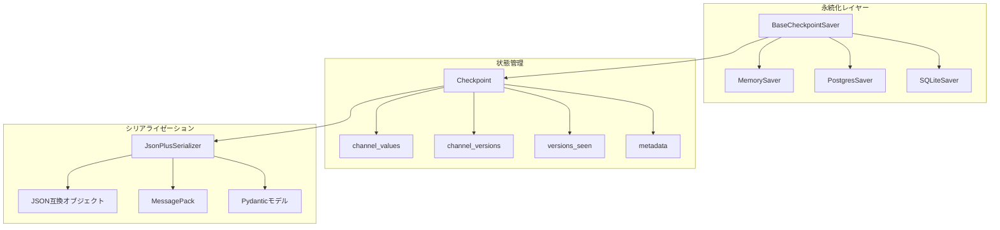

### チェックポイントの作成タイミングと詳細プロセス

#### 1. **入力チェックポイント**: グラフ実行開始前
```python
# pregel/__init__.py:invoke()
def invoke(self, input, config=None):
    # 初期チェックポイントまたは空チェックポイントの作成
    with self._prepare_state(config, input=input) as loop:
        # 入力をチャネルに書き込み、最初のチェックポイントを保存
        loop.put_writes(NULL_TASK_ID, input_writes)
```

#### 2. **ループチェックポイント**: 各Super-Step後
```python
# loop.py:after_tick()
def after_tick(self):
    # 新しいバージョンの生成
    new_versions = get_new_channel_versions(
        self.checkpoint["channel_versions"],
        self.channels,
    )
    
    # チェックポイント作成
    self.checkpoint = create_checkpoint(
        self.checkpoint,
        self.channels,
        self.step,
    )
    
    # 非同期でチェックポイント保存
    self._put_checkpoint_fut = self.submit(
        self._checkpointer_put_after_previous,
        self.checkpoint_config,
        self.checkpoint,
        self.checkpoint_metadata,
        new_versions,
    )
```

#### 3. **更新チェックポイント**: 手動状態更新後
```python
# pregel/__init__.py:update_state()
def update_state(self, config, values=None, as_node=None):
    # 状態更新後、新しいチェックポイントを作成
    checkpoint = create_checkpoint(checkpoint, channels, step + 1)
    checkpoint_metadata = {"step": step + 1, "source": "update", "writes": writes}
    
    # チェックポイント保存
    checkpointer.put(config, checkpoint, checkpoint_metadata, new_versions)
```

#### 4. **分岐チェックポイント**: ブランチ作成時
```python
# checkpoint/base/__init__.py:put()
def put(self, config, checkpoint, metadata, new_versions):
    """分岐の場合、親チェックポイントから新しいチェックポイントを作成"""
    if config.get("checkpoint_id"):
        # 既存チェックポイントから分岐
        parent_checkpoint = self.get(config)
        checkpoint = copy_checkpoint(parent_checkpoint)
```

### 状態永続化の詳細メカニズム

#### チャネル状態のシリアライゼーション

```python
# channels/base.py:BaseChannel
class BaseChannel:
    def checkpoint(self) -> Any:
        """チャネルの現在状態をシリアライズ可能な形式で返す"""
        
    @classmethod
    def from_checkpoint(cls, checkpoint: Any) -> Self:
        """チェックポイントからチャネルを復元"""

# 例：LastValueチャネル
class LastValue(BaseChannel):
    def checkpoint(self):
        return self.value if self.value is not MISSING else None
        
    @classmethod 
    def from_checkpoint(cls, checkpoint):
        channel = cls()
        if checkpoint is not None:
            channel.value = checkpoint
        return channel
```

#### バージョン管理システム

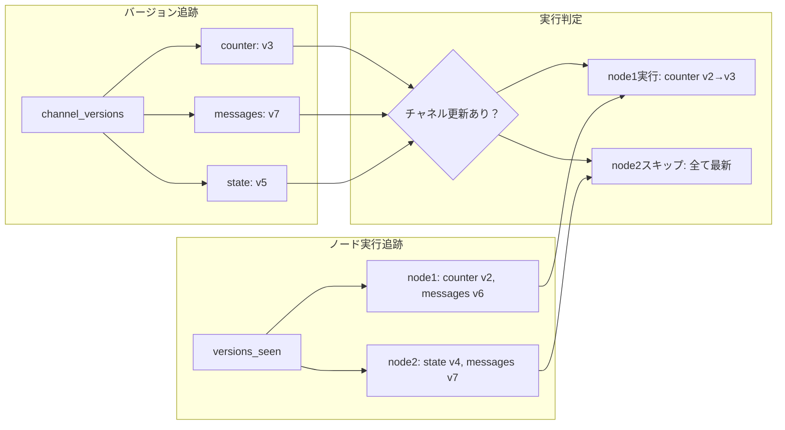

### チェックポイント構造

```python
# checkpoint/base/__init__.py
class Checkpoint(TypedDict):
    v: int                                    # バージョン番号
    id: str                                   # 一意識別子（UUID6）
    ts: str                                   # ISO 8601タイムスタンプ
    channel_values: dict[str, Any]            # チャネルの値
    channel_versions: ChannelVersions         # チャネルのバージョン
    versions_seen: dict[str, dict[str, Any]]  # ノードが見たバージョン
```

### チェックポイント保存プロセス

```python
# pregel/checkpoint.py:create_checkpoint
def create_checkpoint(
    checkpoint: Checkpoint,
    channels: Mapping[str, BaseChannel] | None,
    step: int,
    *,
    id: str | None = None,
) -> Checkpoint:
    ts = datetime.now(timezone.utc).isoformat()
    
    # チャネルから現在の値を取得
    if channels is None:
        values = checkpoint["channel_values"]
    else:
        values = {}
        for k in channels:
            if k not in checkpoint["channel_versions"]:
                continue
            v = channels[k].checkpoint()  # 各チャネルの状態をシリアライズ
            if v is not MISSING:
                values[k] = v
    
    return Checkpoint(
        v=LATEST_VERSION,
        ts=ts,
        id=id or str(uuid6(clock_seq=step)),
        channel_values=values,
        channel_versions=checkpoint["channel_versions"],
        versions_seen=checkpoint["versions_seen"],
    )
```

## 5. 循環実行の実例

### シンプルな循環グラフ

```python
def increment_node(state):
    counter = state.get("counter", 0)
    if counter < 5:  # 循環終了条件
        return {"counter": counter + 1}
    else:
        return {}  # 空の更新で終了

graph = StateGraph({"counter": int})
graph.add_node("increment", increment_node)
graph.add_edge("increment", "increment")  # 自己ループ
graph.set_entry_point("increment")
graph.set_finish_point("increment")

app = graph.compile(checkpointer=MemorySaver())
```

### 実行シーケンス

1. **Step 1**: `{"counter": 0}` → increment実行 → `{"counter": 1}`
2. **Step 2**: `{"counter": 1}` → increment実行 → `{"counter": 2}`
3. **Step 3**: `{"counter": 2}` → increment実行 → `{"counter": 3}`
4. **Step 4**: `{"counter": 3}` → increment実行 → `{"counter": 4}`
5. **Step 5**: `{"counter": 4}` → increment実行 → `{"counter": 5}`
6. **Step 6**: `{"counter": 5}` → increment実行 → `{}` (空更新)
7. **終了**: 更新なしにより実行終了

### 状態追跡例

各ステップでの状態：

```
Step 1:
  checkpoint_id: "01234567-89ab-cdef"
  channel_versions: {"counter": 1}
  versions_seen: {"increment": {"counter": 0}}

Step 2:
  checkpoint_id: "01234567-89ab-cdf0"
  channel_versions: {"counter": 2}
  versions_seen: {"increment": {"counter": 1}}

...
```

## 6. エラーハンドリングと制限

### 無限ループ防止

```python
# デフォルト制限
DEFAULT_RECURSION_LIMIT = 25

# カスタム制限
graph.invoke(
    {"messages": [("user", "Hello")]},
    {"recursion_limit": 100}
)
```

### 中断制御

```python
# 特定のノード前後での中断
graph = StateGraph(...)
graph.add_node("human_review", human_review_node)

app = graph.compile(
    checkpointer=MemorySaver(),
    interrupt_before=["human_review"],  # 人間の確認前に中断
    interrupt_after=["critical_decision"]  # 重要な決定後に中断
)
```

## まとめ

LangGraphの循環タスクグラフ実行は以下の特徴を持ちます：

1. **安全な循環実行**: バージョンベースの実行制御と再帰制限により無限ループを防止
2. **効率的な状態管理**: 増分実行により変更されたチャネルのみを処理
3. **永続化された状態**: チェックポイントシステムによる完全な状態復元
4. **柔軟な制御**: 条件分岐、中断、人間の介入をサポート
5. **並列実行**: Super-Step内でのタスクの効率的な並列処理

この設計により、LangGraphは複雑な循環ワークフローを安全かつ効率的に実行し、任意の時点で実行を中断・再開できる堅牢なシステムを提供します。

## 7. 実行の再開メカニズム

### 中断からの再開プロセス

LangGraphでは、実行が中断された場合でも、保存されたチェックポイントから完全に実行を再開できます。

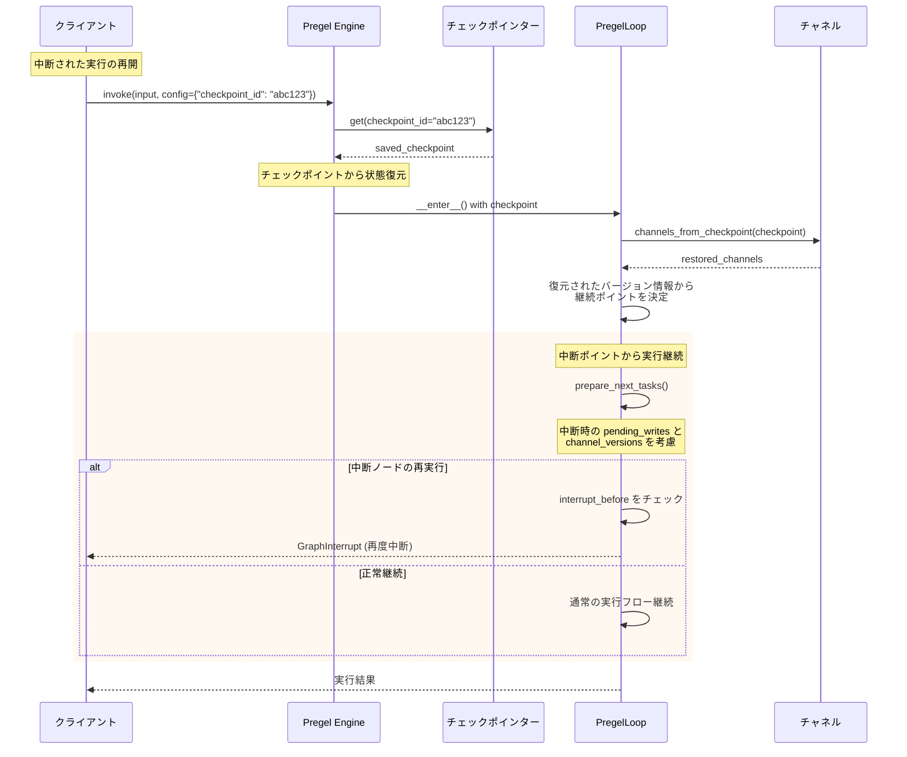

### 中断タイプ別の再開処理

#### 1. **interrupt_before による中断**

```python
# pregel/__init__.py:invoke()
def invoke(self, input, config):
    with self._prepare_state(config, input=input) as loop:
        # 中断前チェック
        if self.interrupt_before and should_interrupt(
            loop.checkpoint, self.interrupt_before, loop.tasks.values()
        ):
            # 中断ポイントで一時停止
            raise GraphInterrupt()
```

**再開時の処理:**
```python
# 再開時は中断されたタスクから実行継続
if loop.interrupt_before:
    # 中断ノードが再度トリガーされる
    interrupted_tasks = should_interrupt(...)
    if interrupted_tasks:
        # 人間の承認待ちや条件変更後に再実行
```

#### 2. **interrupt_after による中断**

```python
# loop.py:after_tick()
def after_tick(self):
    # タスク実行後の中断チェック
    if self.interrupt_after and should_interrupt(
        self.checkpoint, self.interrupt_after, completed_tasks
    ):
        raise GraphInterrupt()
```

#### 3. **手動中断 (Manual Interrupt)**

```python
# 実行中にクライアントから中断
graph.invoke(input, config={"thread_id": "thread1"})
# 別のプロセスから中断を送信
graph.update_state(config={"thread_id": "thread1"}, as_node=INTERRUPT)
```

### 状態復元の詳細プロセス

#### チェックポイントからの完全復元

```python
# pregel/checkpoint.py:channels_from_checkpoint
def channels_from_checkpoint(
    specs: Mapping[str, BaseChannel | ManagedValueSpec],
    checkpoint: Checkpoint,
) -> tuple[Mapping[str, BaseChannel], ManagedValueMapping]:
    """チェックポイントから全チャネル状態を復元"""
    
    channel_specs = {k: v for k, v in specs.items() if isinstance(v, BaseChannel)}
    managed_specs = {k: v for k, v in specs.items() if not isinstance(v, BaseChannel)}
    
    # 各チャネルの状態復元
    restored_channels = {
        k: v.from_checkpoint(checkpoint["channel_values"].get(k, MISSING))
        for k, v in channel_specs.items()
    }
    
    return restored_channels, managed_specs
```

#### バージョン情報の復元

```python
# loop.py:__enter__()
def __enter__(self):
    # チェックポイントから実行状態を復元
    self.checkpoint = self.checkpointer.get(self.checkpoint_config) or empty_checkpoint()
    self.checkpoint_metadata = self.checkpointer.get_tuple(self.checkpoint_config).metadata
    
    # ステップカウンタの復元
    self.step = self.checkpoint_metadata.get("step", 0) + 1
    self.stop = self.step + self.config.get("recursion_limit", 25) + 1
    
    # チャネルとバージョン情報の復元
    self.channels, self.managed = channels_from_checkpoint(
        self.specs, self.checkpoint
    )
```

### 実行再開の実例

#### Human-in-the-Loop による中断・再開

```python
# グラフ定義（人間の承認が必要なワークフロー）
def approval_needed(state):
    return {"status": "pending_approval", "request": state["request"]}

def process_request(state):
    if state["status"] == "approved":
        return {"result": f"Processed: {state['request']}"}
    else:
        return {"result": "Request denied"}

graph = StateGraph({"request": str, "status": str, "result": str})
graph.add_node("approval", approval_needed)
graph.add_node("process", process_request)
graph.add_edge("approval", "process")

# 承認ノード前で中断するよう設定
app = graph.compile(
    checkpointer=MemorySaver(),
    interrupt_before=["process"]  # processノード実行前に中断
)

# 1. 初回実行（中断まで）
config = {"thread_id": "workflow_123"}
try:
    result = app.invoke({"request": "新機能追加"}, config)
except GraphInterrupt:
    print("承認待ちで中断されました")

# 2. 手動で承認状態に更新
app.update_state(
    config, 
    {"status": "approved"}, 
    as_node="approval"
)

# 3. 実行再開（中断ポイントから継続）
result = app.invoke(None, config)  # inputはNone（継続実行）
print(result)  # {'result': 'Processed: 新機能追加'}
```

#### エラー後の再開

```python
# エラーハンドリングと再開
def unreliable_task(state):
    import random
    if random.random() < 0.5:  # 50%の確率で失敗
        raise Exception("Network error")
    return {"processed": True}

graph = StateGraph({"data": str, "processed": bool})
graph.add_node("task", unreliable_task)

app = graph.compile(checkpointer=MemorySaver())

config = {"thread_id": "retry_example"}
max_retries = 3

for attempt in range(max_retries):
    try:
        result = app.invoke({"data": "important_data"}, config)
        print(f"成功: {result}")
        break
    except Exception as e:
        print(f"試行 {attempt + 1} 失敗: {e}")
        if attempt < max_retries - 1:
            print("チェックポイントから再開します...")
            # 次の試行では同じconfigで自動的にチェックポイントから再開
```

### 分散環境での実行継続

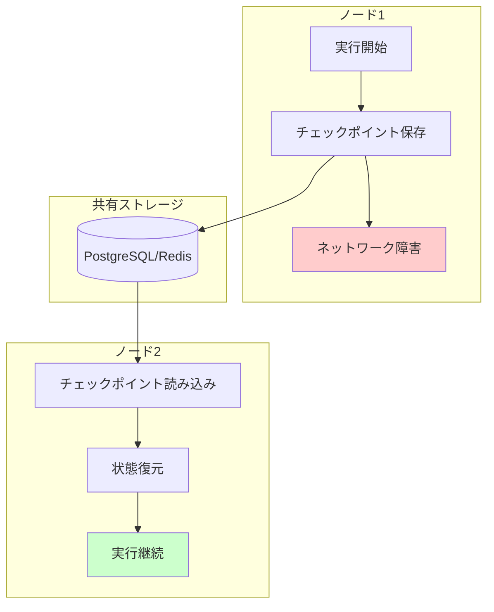

この分散実行機能により、LangGraphは：

1. **ノード障害からの自動回復**: 他のノードで実行継続
2. **負荷分散**: 長時間実行をノード間で分散
3. **スケールアウト**: 需要に応じたノード追加
4. **メンテナンス**: ローリングアップデート対応

これらの機能により、LangGraphは企業レベルの堅牢性と可用性を提供し、ミッションクリティカルなワークフローの実行を保証します。