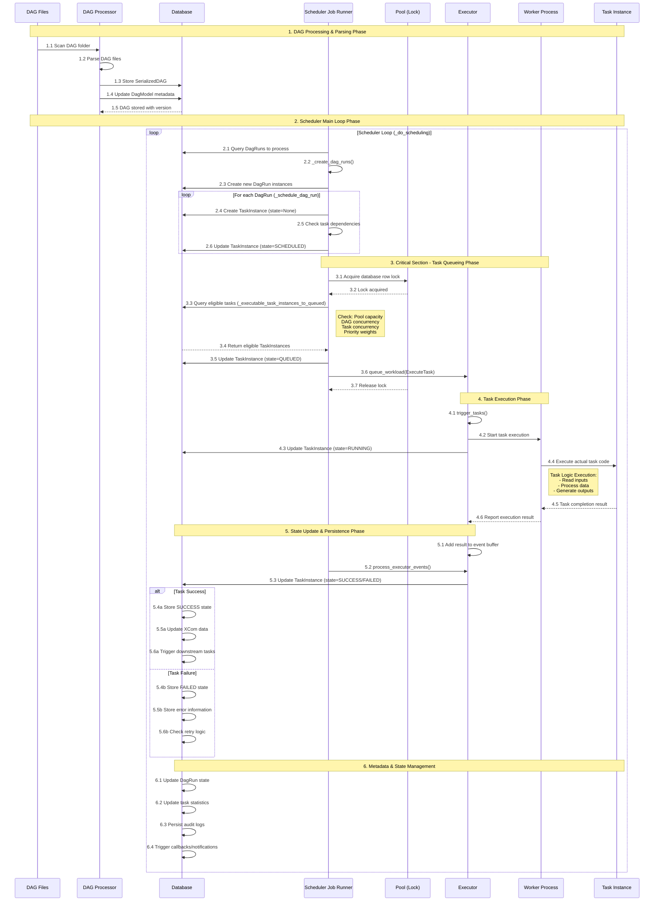

# Apache Airflow Task Execution Sequence

## シーケンス図



## 詳細解説

### 1. DAG処理・解析フェーズ

**関与コンポーネント:**
- `DagFileProcessorProcess`: DAGファイルの解析を担当
- `SerializedDagModel`: DAGのシリアル化データを保存
- `DagModel`: DAGのメタデータを管理

**プロセス:**
1. DAGディレクトリのスキャン
2. Pythonファイルの解析と検証
3. DAGオブジェクトのシリアル化
4. データベースへの永続化

### 2. スケジューラーメインループ

**主要メソッド:** `_do_scheduling()`

**処理内容:**
- 新しいDagRunインスタンスの作成
- タスクの依存関係チェック
- TaskInstanceの状態管理（None → SCHEDULED）

### 3. クリティカルセクション（タスクキューイング）

**重要な排他制御:**
- Poolテーブルでの行ロック
- 同時実行制限の確認
- タスクの優先順位付け

**状態遷移:** SCHEDULED → QUEUED

### 4. タスク実行フェーズ

**Executorの役割:**
- `ExecuteTask` ワークロードの管理
- 実際のタスク実行の開始
- 実行状態の監視

**状態遷移:** QUEUED → RUNNING

### 5. 状態更新・永続化

**イベント駆動アーキテクチャ:**
- Executorからのイベントバッファ
- データベースへの状態更新
- 下流タスクのトリガー

**最終状態:** RUNNING → SUCCESS/FAILED

## タスク状態の詳細管理

### タスクインスタンスの状態遷移

```
None (初期状態)
  ↓
SCHEDULED (依存関係満足)
  ↓
QUEUED (実行キューに追加)
  ↓
RUNNING (実行中)
  ↓
SUCCESS/FAILED (完了)
```

### 特殊状態

- **DEFERRED**: 非同期待機中
- **UP_FOR_RETRY**: リトライ待機中  
- **UP_FOR_RESCHEDULE**: 再スケジュール待機中
- **SKIPPED**: スキップされた

## データベーススキーマと永続化

### 主要テーブル

1. **task_instance**: タスクの実行状態
2. **dag_run**: DAGの実行インスタンス
3. **dag**: DAGのメタデータ
4. **serialized_dag**: シリアル化されたDAG定義
5. **slot_pool**: リソースプール管理

### 永続化戦略

- **即座の状態更新**: 状態変更は即座にデータベースに反映
- **トランザクション管理**: 重要な操作は適切なトランザクション内で実行
- **監査ログ**: すべての状態変更が記録される

## 同時実行制御

### Pool Management
- **slot_pool テーブル**: リソースの割り当て制限
- **同時実行タスク数**: プール単位での制御
- **優先度ベース**: タスクの重要度による実行順序制御

### 排他制御
- **行レベルロック**: データベースレベルでの競合回避
- **クリティカルセクション**: スケジューラー間での調整
- **デッドロック回避**: 適切なロック順序の実装

## エラーハンドリングと復旧

### 失敗時の処理
1. **エラー情報の永続化**: 例外情報とスタックトレースの保存
2. **リトライメカニズム**: 設定可能な再試行回数と間隔
3. **通知システム**: 失敗時のアラート送信
4. **手動介入**: 管理者による手動での状態変更

### 整合性保証
- **状態の原子性**: 状態変更の不可分性
- **イベント順序**: 正しい順序でのイベント処理
- **データ整合性**: 外部キー制約によるデータ整合性維持

このシーケンスにより、Apache Airflowは大規模で複雑なワークフローを信頼性高く実行できます。