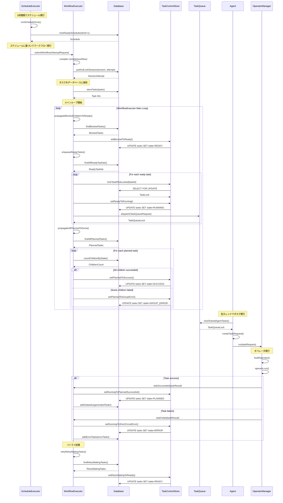
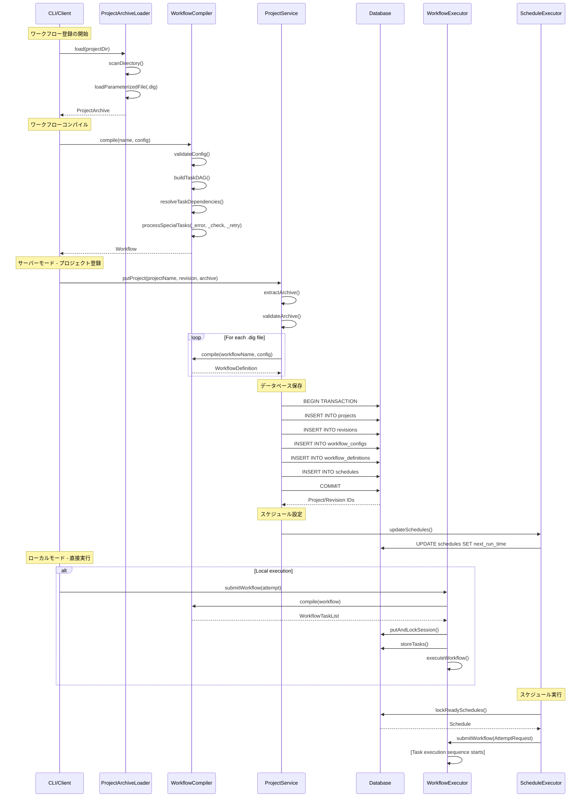

# Digdag Task Execution Sequence

このドキュメントは、Digdagにおけるタスクの実行シーケンスを詳細に説明し、スケジューラー、永続化、タスクの状態管理の関係を明らかにします。

## 概要

Digdagは、データベースを中心とした分散状態マシンとして動作します。複数のコンポーネントが協調してワークフローを実行し、タスクの状態をデータベースに永続化します。

## タスクの状態遷移

```
BLOCKED → READY → RUNNING → PLANNED → SUCCESS
                      ↓
                   ERROR → RETRY_WAITING → READY
```

## 主要コンポーネント

- **ScheduleExecutor**: スケジュール実行の起点
- **WorkflowExecutor**: ワークフロー実行エンジン
- **TaskControlStore**: タスク状態の永続化
- **Agent**: タスクの実際の実行
- **Database**: 状態管理の権威的データソース

## 実行シーケンス図



## 詳細な実行フロー

### 1. スケジューラーによるワークフロー起動

```java
// ScheduleExecutor.runScheduleOnce()
executor.scheduleWithFixedDelay(() -> runSchedules(), 1, 1, TimeUnit.SECONDS);
```

**実行手順：**
1. **スケジュールロック**: `lockReadySchedules(limit=1)` でデッドロック回避
2. **ワークフロー定義取得**: データベースからワークフロー定義を取得
3. **AttemptRequest作成**: スケジュール時刻とパラメータを設定
4. **ワークフロー実行**: `workflowExecutor.submitWorkflow()` を呼び出し

### 2. セッションと試行の作成

```java
// WorkflowExecutor.submitWorkflow()
Workflow workflow = compiler.compile(def.getName(), def.getConfig());
WorkflowTaskList tasks = workflow.getTasks();
return submitTasks(siteId, ar, tasks);
```

**データベース操作：**
1. **セッション作成**: プロジェクトID、ワークフロー名、セッション時刻でSession作成
2. **試行作成**: リトライ名、パラメータ、タイムゾーンでSessionAttempt作成
3. **トランザクション**: `putAndLockSession()` でセッションと試行を原子的に作成
4. **タスク保存**: `storeTasks()` で全ワークフロータスクをデータベースに挿入

### 3. タスク状態管理と永続化

**TaskStateCode列挙型**による状態定義：
- **BLOCKED(0)**: 依存関係待ち
- **READY(1)**: 実行準備完了
- **RUNNING(4)**: 実行中
- **PLANNED(5)**: 完了、子タスク処理中
- **SUCCESS(7)**: 成功完了
- **ERROR(8)**: 失敗
- **GROUP_ERROR(6)**: 子タスク失敗によるグループ失敗
- **RETRY_WAITING(2)**: リトライ待機中
- **CANCELED(9)**: キャンセル

**状態遷移の永続化**：
```java
// TaskControlStore の原子的状態更新
setReadyToRunning()                  // READY → RUNNING
setRunningToPlannedSuccessful()      // RUNNING → PLANNED (子タスクあり)
setRunningToShortCircuitSuccess()    // RUNNING → SUCCESS (子タスクなし)
setRunningToShortCircuitError()      // RUNNING → ERROR
```

### 4. WorkflowExecutorメインループ

**1秒間隔でのポーリング実行**：
```java
workflowExecutor.runWhile(() -> !stop);
```

**実行サイクル**：
1. **`propagateBlockedChildrenToReady()`**: 依存関係が満たされたタスクをBLOCKED → READY
2. **`retryRetryWaitingTasks()`**: リトライ時間経過したタスクをRETRY_WAITING → READY
3. **`enqueueReadyTasks()`**: READYタスクをキューに送信
4. **`propagateAllPlannedToDone()`**: PLANNEDタスクの子タスク完了チェック、SUCCESS/ERRORに遷移
5. **`propagateSessionArchive()`**: 完了セッションのアーカイブ

### 5. タスクキューとエージェントの相互作用

**タスクエンキュー処理**：
1. **`enqueueReadyTasks()`**: `findAllReadyTaskIds()` でREADYタスクを検索
2. **`enqueueTask()`**: 個別タスクをロックし：
   - タスクがまだREADY状態か確認
   - タスクIDベースの一意名で`TaskQueueRequest`作成
   - `dispatcher.dispatch()` でキューに送信
   - 原子的にタスクをRUNNING状態に遷移

**エージェント実行**：
1. **`MultiThreadAgent`**: 別スレッドで実行、タスクをポーリング
2. **`lockSharedAgentTasks()`**: ロック保持でキューからタスク取得
3. **`OperatorManager.run()`**: 実際のタスクロジック実行
4. **タスク完了**: `WorkflowExecutor.taskSucceeded()` または `taskFailed()` にコールバック

### 6. データベース相互作用とトランザクション管理

**TransactionManager**による一貫性確保：
- 全状態変更はデータベーストランザクション内で実行
- **楽観的ロック**: 同時状態変更を防止
- **行レベルロック**: タスク状態一貫性を保証

**主要データベース操作**：
- **SessionStoreManager**: セッション、試行、タスクの管理
- **TaskControlStore**: 原子的タスク状態遷移
- **タスク関係**: 依存関係追跡のため別途保存
- **パラメータ保存**: exportパラメータとstoreパラメータをタスクごとに追跡

### 7. タスク依存関係の解決

**依存関係管理**：
1. **タスクコンパイル**: `WorkflowCompiler` が親/子および上流関係でタスクDAGを構築
2. **依存関係追跡**: データベースにタスク関係として保存
3. **準備完了チェック**: 上流の全依存関係が `canRunDownstreamStates()` (SUCCESS) の時タスクがREADY
4. **並列実行**: `_parallel` 設定と依存関係解決により制御

### 8. エラーハンドリングと回復

**タスク失敗処理**：
1. **エラータスク生成**: 失敗タスクが `_error` 子タスクをトリガー
2. **リトライロジック**: `RetryControl` がリトライ間隔と試行回数を管理
3. **グループエラー伝播**: 子タスク失敗時に親タスクがGROUP_ERRORに遷移
4. **状態回復**: 失敗タスクを最後の成功チェックポイントから再開可能

## 主要なデータフロー

```
Scheduler → WorkflowExecutor → TaskQueue → Agent → Database
    ↓           ↓                 ↓         ↓        ↓
Schedule    Session/Attempt    Task      Operator   State
Trigger  →  Creation      → Enqueue  →  Execution → Persistence
```

## 重要な設計原則

1. **分散状態マシン**: データベースがタスク状態の権威的ソース
2. **ポーリングループ**: 状態変化を検出して伝播
3. **楽観的並行性**: 複数のエグゼキューターが安全に動作
4. **エージェントスレッド**: 独立してタスクを実行し、結果を報告
5. **水平スケーラビリティ**: 複数のWorkflowExecutorとAgentインスタンスが並行動作

この設計により、Digdagは高可用性と拡張性を持つワークフロー実行エンジンを実現しています。

## ワークフロー登録シーケンス

### 概要

Digdagでは、.digファイルで定義されたワークフローが以下の段階を経て実行可能な形に変換されます：

1. **プロジェクトロード**: .digファイルの発見と読み込み
2. **ワークフローコンパイル**: 設定の解析とタスクDAGの構築
3. **データベース保存**: ワークフロー定義の永続化
4. **スケジュール設定**: 定期実行の設定
5. **実行準備**: セッションと試行の作成

### 主要コンポーネント

- **ProjectArchiveLoader**: プロジェクトの読み込み
- **WorkflowCompiler**: .dig設定のコンパイル
- **ProjectService**: サーバーモードでのプロジェクト管理
- **LocalSite**: ローカルモードでのワークフロー管理
- **WorkflowExecutor**: ワークフローの実行制御

### ワークフロー登録シーケンス図



### 詳細な登録フロー

#### 1. プロジェクトアーカイブの読み込み

**ProjectArchiveLoader.load()の処理**：
```java
// プロジェクトディレクトリのスキャン
Files.walk(projectDir)
    .filter(path -> path.toString().endsWith(".dig"))
    .forEach(this::loadWorkflowFile);

// 各.digファイルの読み込み
Config config = configLoader.loadParameterizedFile(digFile);
WorkflowFile workflowFile = WorkflowFile.of(name, config);
```

**主要処理**：
1. **ディレクトリスキャン**: `.dig`ファイルを再帰的に検索
2. **設定読み込み**: `ConfigLoaderManager`でYAML/JSON解析
3. **アーカイブ作成**: `ProjectArchive`オブジェクトの構築
4. **メタデータ生成**: `ArchiveMetadata`の作成

#### 2. ワークフローコンパイル

**WorkflowCompiler.compile()の処理**：
```java
// タスクDAGの構築
WorkflowTaskList tasks = compileTasks(config, Optional.empty());

// 依存関係の解決
resolveDependencies(tasks);

// 特殊タスクの処理
processErrorTasks(tasks);
processCheckTasks(tasks);
processRetryTasks(tasks);
```

**コンパイル手順**：
1. **構文検証**: YAML/JSON構文の妥当性チェック
2. **タスクDAG構築**: 親子関係と依存関係の解析
3. **依存関係解決**: `_after`、`_parallel`の処理
4. **特殊タスク処理**: `_error`、`_check`、`_retry`の展開
5. **パラメータ継承**: `_export`、`_secrets`の伝播

#### 3. データベーススキーマと保存

**主要テーブル**：
```sql
-- プロジェクト管理
projects (id, site_id, name, created_at)
revisions (id, project_id, name, archive_type, archive_path, archive_md5, created_at)

-- ワークフロー定義
workflow_configs (id, project_id, config_digest, timezone, config)
workflow_definitions (id, config_id, revision_id, name)

-- スケジュール管理
schedules (id, project_id, workflow_definition_id, next_run_time, next_schedule_time)
```

**保存処理**：
1. **プロジェクト作成**: `ProjectControl.insertRevision()`
2. **ワークフロー保存**: `insertWorkflowDefinitions()`
3. **スケジュール設定**: `updateSchedules()`
4. **トランザクション**: 全操作が原子的に実行

#### 4. スケジュール設定と実行準備

**スケジュール処理**：
```java
// スケジュール設定の更新
scheduleStore.updateSchedules(projectId, workflowDefinitions);

// 次回実行時刻の計算
Instant nextRunTime = scheduleExecutor.getNextScheduleTime(schedule);
```

**実行準備**：
1. **スケジュール作成**: 各ワークフローの実行スケジュールを設定
2. **次回実行時刻**: cron式やinterval設定に基づく計算
3. **タイムゾーン処理**: ワークフローごとのタイムゾーン設定
4. **実行権限**: プロジェクト単位のアクセス制御

#### 5. CLI コマンドとの連携

**Push コマンド (サーバーモード)**：
```bash
digdag push myproject --revision 1.0.0
```
1. **アーカイブ作成**: `Archiver.createArchive()`でtarball生成
2. **クライアント送信**: `DigdagClient.putProjectRevision()`
3. **サーバー処理**: `ProjectResource.putProject()`で受信・処理

**Run コマンド (ローカルモード)**：
```bash
digdag run workflow.dig
```
1. **プロジェクト読み込み**: `Arguments.loadProject()`
2. **ローカル保存**: `LocalSite.storeLocalWorkflowsWithoutSchedule()`
3. **即座実行**: `WorkflowExecutor.submitWorkflow()`

### 重要な設計パターン

1. **段階的処理**: ファイル読み込み → コンパイル → 保存 → 実行の明確な分離
2. **トランザクション管理**: データベース操作の原子性保証
3. **モード分離**: サーバーモードとローカルモードの処理分岐
4. **依存関係解決**: 複雑なタスクDAGの正確な構築
5. **エラーハンドリング**: 各段階での適切なエラー処理と報告

この登録シーケンスにより、Digdagは複雑なワークフロー定義を効率的に管理・実行できるアーキテクチャを提供しています。